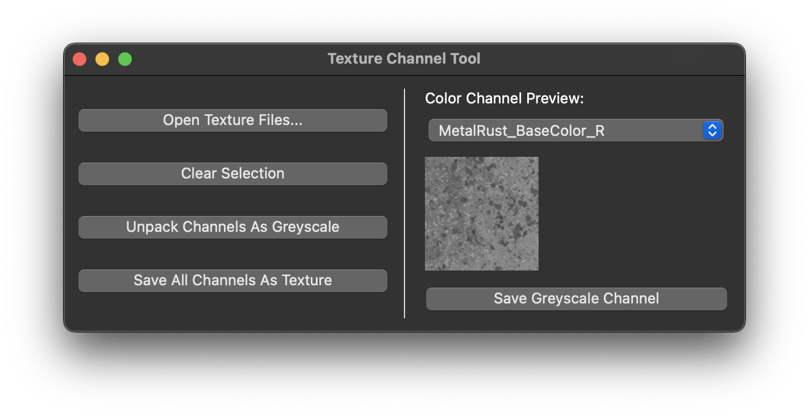

# Mask Layer Creation Tool - Pipeline



The Mask Layer Texture Tool is a Python-based utility designed for combining multiple grayscale texture maps (such as specular, roughness, ambient occlusion) into a single mask layer using RGBA channels. This allows each grayscale map to be stored efficiently in separate color channels of one texture, reducing file clutter and optimizing texture workflows.

Additionally, the tool supports extracting individual RGBA channels, separating them back into standalone grayscale texture maps for further use in materials and shading.

## Features

1. **Unpacking** - Unpack texture map colour channels into seperate greyscale images.
2. **Packing** - Pack texture greyscales into a single image with multiple colour channels.
3. **Command-line Interface (CLI)** - Advanced users can process textures via CLI for automation.
4. **QT-Based Graphical UI** - Interactive UI for previewing and managing texture maps.
5. **(Planned) DTX Compression** - Integration of DXT compression via libsquish or a similar method.

## Installation

### Dependencies
- `numpy` => 2.2.3
- `openimageio` >= 3.0.5.0
- `pyside6` >= 6.9.0
- `pytest` >= 8.3.4

Clone repository, then install dependencies using [UV Package Manager](https://github.com/astral-sh/uv):
```
$ git clone git@github.com:NCCA/pipeline-project-wjake.git
$ cd pipeline-project-wjake && uv sync
```

## Usage

### Command-line
```
$ python main.py pack specular.exr roughness.exr ao.exr packed_texture.exr
$ python main.py unpack packed_texture.exr output_directory/
```

### Graphical UI

Start graphical user-interface:
```
$ python main.py
```

- Select grayscale texture maps for packing into an RGBA texture.
- View individual channels and extract grayscale maps from an existing RGBA texture.
- Save packed textures for streamlined material workflows.

## Rationale
Currently an artist looking to combine mutliple greyscale texture maps into a mask layer will typically use image processing software such as Photoshop (PS) or  GNU Image Manipulation Program (GIMP) - this solution is time comsuming and inefficient. 
### Benefits of using mask layers instead of individual texture maps
- Memory Efficiency (Fewer textures lowers memory usage footprint)
- Simplified Asset Management (Managing a lower number of texture files)
- Performance (Reduced number of texture samplers needed)

---

[](https://classroom.github.com/a/Tn7g_Mhz)